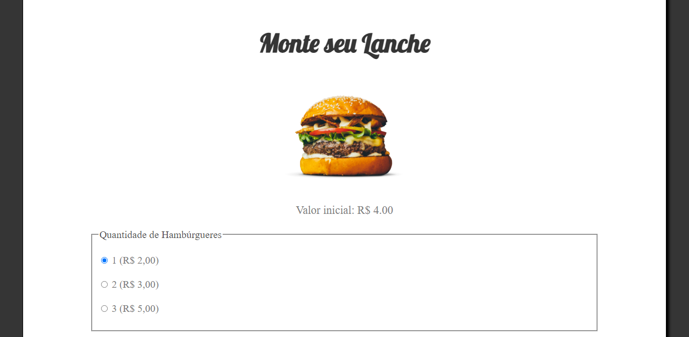

# Site de Pedidos Fast-Food
Pequeno projeto criado utilizando NodeJS. Um site de lanchonete, onde o usuário poderá montar seu lanche conforme desejar e, ao final da página, poderá calcular o valor total, onde poderá escolher se realizará o pedido ou não.

## Confira

### Home

	
	

### Tela de Total

	

